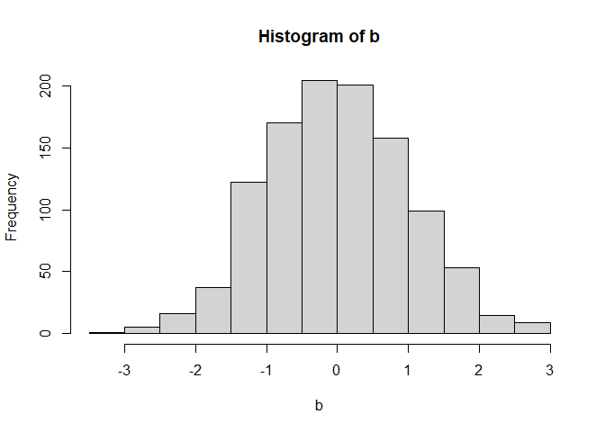

TEST 1
================
Jiyeon Park
2022-07-26

## TEST file

``` r
a<-rbinom(100, size=50, prob=0.2)
mean(a)
```

    ## [1] 9.4

``` r
hist(a)
```

<!-- -->

``` r
b<-rnorm(1090)
mean(b)
```

    ## [1] 0.002196244

``` r
hist(b)
```

<!-- -->
